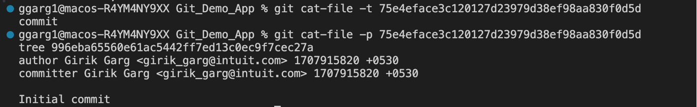
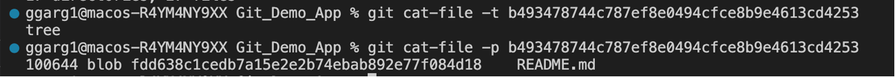

## How does Git internally work? ##

Refer this article for understanding about Git internals, all the discussion in this document is inspired from this article : [Git internals working](https://git-scm.com/book/en/v2/Git-Internals-Git-Objects)

Git internally uses these data structures:

1. Hashing 

2. Tree data structure

```
At the core of it, Git is like a key value store. 

The key is a hash generated based upon the data.

The value is a blob object, which includes the data itself. Explained below.

Every blob object is identified by its unique hash.
```

Git uses a cryptographic hash function: SHA1 

For a given data, it outputs 40 digit hexadecimal number. The hash value is always same for the same data.

Git compresses the data in a blob (binary large object), and stores some metadata about data.

**What is the structure of the Blob object that Git stores?**


The blob structure starts with the Git object's type, which in this case is blob, followed by a single space which acts as a delimiter between values.

Second comes the size of the blob's data in bytes. This size is calculated to include the object's type, size, delimiters, and binary content.

Next comes a NUL byte, represented by the \0 character. This is just an empty byte 00000000 and also acts as a delimiter.

Lastly comes the file's binary content.

See this article for reference: [Git blob format](https://initialcommit.com/blog/what-is-a-blob-in-git#what-is-the-git-blob-format)

**It is also good to know about the different types of objects in Git, blob is one of them**

Let's understand the bigger picture first, which will help us to understand the different types of objects in Git.


All the objects shown in the figure above, are identified by their unique SHA1 values.

In order to understand the diagram above, consider a scenario where you have file.txt and other.txt in the root directory. 
The root directory has a 'folder' subdirectory. The 'folder' subdirectory has 'nested.txt' and 'other.txt' files. The commit object points to the tree object of the root directory, in this way, the commit object keeps track of all the changes in the directory. The tag object points to the commit object.

- A "blob" object is used to store file data - it is generally a file.

- A "tree" object is basically like a directory - it references a bunch of other trees and/or blobs (i.e. files and sub-directories)

- A "commit" object points to a single tree, marking it as what the project looked like at a certain point in time. It contains meta-information about that point in time, such as a timestamp, the author of the changes since the last commit, a pointer to the previous commit(s), etc.

- A "tag" object is a way to mark a specific commit as special in some way. It is normally used to tag certain commits as specific releases or something along those lines.

Compare blob objects to the leaf nodes of the tree, and the tree objects to the internal nodes of the tree in the file hierarchy structure.

Feel free to have a look at these resources: 

[Quora Link](https://www.quora.com/What-is-a-git-object-What-are-the-different-types-of-objects-in-Git)

[Article Link](http://shafiul.github.io/gitbook/1_the_git_object_model.html)

This is the tree structure of the `.git` folder of a newly initialized Git repository, we'll go through some of the relevant stuff like HEAD and objects.


**Let's explore about the SHA1 algorithm used by Git**

Let's use `echo 'Hello Git' | git hash-object --stdin` . What this does is, it raeds the string 'Hello Git' from the stdin and generates the 40 digit hexadecimal SHA1 hash, the same way Git generates a hash when we stage a file.

We get the same hash for the same string, regardless of how many times we run the command.


Now, using the `-w` option, we can write this object into the object database, so we will be able to see it in the `.git/objects` folder. See the screenshot below:


From the above screenshot, we can see that a folder with the initials '9f' (the first two letters of the SHA1 hashing algorithm) got created with a blob object file named '4d96d5b00d98959ea9960f069585ce42b1349a' (the remaining 38 letters of hashing algorithm).

**Let's now understand how the blob object is created when we stage a file.**


When no changes are tracked, we observe that there are no blob objects in the `.git/objects`.


When we stage a file, a blob object is created, in the `.git/objects` . It's important to note that the blob object is created when the changes are staged, not committed. When the changes are committed, a commit object is created.

We won't be able to read the contents of the object file using 'cat', as it is a binary file (blob), so the contents wouldn't be correctly printed on the screen.

Let's try to view the contents of the blob object by using `git cat-file -p <40 digit SHA1 Hash>`. 

 

Also, we can see the type of the object (whether the object is a blob, tree, commit or tag object), by using `git cat-file -t <40 digit SHA1 Hash>`. See example below:

 

**Let's now try to explore about tree objects**

Consider that we have the folder structure, as described below:


Now, when we stage all these files, we expect to have a structure as follows :


Let's check whether our expectation is correct or not.


In the screenshots above, we only see blob objects and no tree object is there. 

Let's find out why is this so?

Whenever we stage files, only blob objects are created. No tree objects are created when the files are in staging area.

The tree objects are created only when the changes are committed. Let's now try to commit the changes, and observe the different types of objects. The expectation is something like:


Let's find out whether our expectation is correct :


As we can see, we have 5 different objects. Let's explore them one by one.

Let's have a look at the `commit object` :



The commit object has a pointer to the tree object, the author and committer details, along with the timestamps and the commit message. 

**What's the difference between author and committer?**  The author is the person who originally wrote the patch, whereas the committer is the person who last applied the patch. So, if you send in a patch to a project and one of the core members applies the patch, both of you get credit — you as the author and the core member as the committer.

**Why don't two commits have the same commit ID?** Notice carefully that the commit object has a timestamp field for storing the time at which the patch was authored and committed, and these won't be the same for any two commits. The commit ID is generated by running SHA1 algorithm on the contents. Hence, the commit ID won't also be same for two different commits.


From the screenshot above, we can see that there is a tree object which points to the blob object of 'README.md' inside the root directory. There is also a pointer to a tree object, which points to the `src` subdirectory.


From the screenshot above, we see that there is a blob object, which contains the data from 'README.md' inside the root directory.



From the screenshot above, we see that we have a tree object corresponding to the `src` folder, which points to the `README.md` inside the `src` folder.

 

From the screenshot above, we see a blob object which corresponds to the `src/README.md` file.

Hence, our expectation was correct !

Let's now try to add a new file called 'New.md' inside the root directory and try to predict what the object structure should look like. The understanding is that Git should create new objects only when required, (like a new blob object for new.md, a new object for commit, and a new object for tree (since the new commit won't be able to point to the old tree object) ). We will reuse the objects wherever possible.

The expectation is something along:


The new links are highlighted in red, and the old ones are highlighted in black. 

Let's understand the reasoning behind the new links. As we know that in Git, every commit has a pointer to its previous commit, so we have a pointer from the second commit to the first commit. There has to be a second tree object, which supports the second commit object. This second tree object should track all the changes in the src folder, the README.md and new.md files, hence the required links have been created.

Let's now validate whether our expectation is correct or not.


From the screenshot above, we can find that there are 8 objects, similar to what we expected.

Let's now explore some of the newly created objects (based upon their hash values):


Fron the screenshot above, we can see that a new blob object has been created for new.md


From the screenshot above, we can see that the tree object has pointers to the 'new.md' blob object, 'src' tree object and 'README.md' blob object.


From the screenshot above, we can see that the second commit object has a pointer to the second tree object. Also, it has a pointer to the previous commit object.

Hence, our expectations were correct !